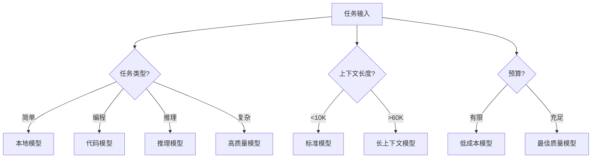

# Claude Code - 智能路由系统

> CCR (Claude Code Router) 和 CC-Switch 提供高级模型管理和智能路由功能，实现多模型统一管理和自动化切换。

## 📋 目录

- [1. 智能路由简介](#1-智能路由简介)
- [2. Claude Code Router (CCR)](#2-claude-code-router-ccr)
- [3. CC-Switch 可视化管理](#3-cc-switch-可视化管理)
- [4. 路由策略配置](#4-路由策略配置)
- [5. 实战案例](#5-实战案例)

---

## 1. 智能路由简介

### 1.1 什么是智能路由？

**智能路由** 是根据任务类型、上下文长度、成本预算等因素，自动选择最合适的 AI 模型的系统。

### 1.2 为什么需要智能路由？

| 问题 | 传统方案 | 智能路由方案 |
|------|----------|--------------|
| **成本高** | 全部用昂贵的 Claude | 简单任务用低成本模型 |
| **速度慢** | 大模型处理所有任务 | 快速任务用轻量模型 |
| **不灵活** | 手动切换模型 | 自动选择最优模型 |
| **无优化** | 固定策略 | 根据实际情况动态调整 |

### 1.3 路由决策因素



---

## 2. Claude Code Router (CCR)

### 2.1 CCR 简介

**CCR** 是命令行路由工具，提供：
- 多 Provider 统一管理
- 灵活的路由规则引擎
- 请求/响应转换器
- 交互式模型管理
- 完整的日志与统计系统

### 2.2 安装 CCR

```bash
npm install -g @musistudio/claude-code-router
```

### 2.3 基础配置

创建 `~/.claude-code-router/config.json`:

```json
{
  "APIKEY": "your-secret-key",
  "LOG": true,
  "LOG_LEVEL": "info",
  "API_TIMEOUT_MS": 600000,
  "HOST": "127.0.0.1",
  "PORT": 8080,
  "Providers": [
    // Provider 配置
  ],
  "Router": {
    // 路由规则
  }
}
```

### 2.4 配置详解

#### 基础配置项

| 字段 | 说明 | 默认值 |
|------|------|--------|
| **APIKEY** | 访问密钥（可选） | - |
| **LOG** | 是否启用日志 | `true` |
| **LOG_LEVEL** | 日志级别 | `info` |
| **API_TIMEOUT_MS** | 超时时间（毫秒） | `600000` |
| **HOST** | 监听地址 | `127.0.0.1` |
| **PORT** | 监听端口 | `8080` |
| **PROXY_URL** | 代理服务器 | - |
| **NON_INTERACTIVE_MODE** | 非交互模式 | `false` |

#### Providers 配置

```json
{
  "Providers": [
    {
      "name": "deepseek",
      "api_base_url": "https://api.deepseek.com/chat/completions",
      "api_key": "$DEEPSEEK_API_KEY",  // 支持环境变量
      "models": ["deepseek-chat", "deepseek-reasoner"],
      "transformer": {
        "use": ["deepseek"]  // 请求转换器
      }
    },
    {
      "name": "ollama",
      "api_base_url": "http://localhost:11434/v1/chat/completions",
      "api_key": "ollama",
      "models": ["qwen2.5-coder:latest", "qwen2.5:7b"]
    }
  ]
}
```

**字段说明**:
- `name`: Provider 标识符
- `api_base_url`: API 基础地址
- `api_key`: API 密钥（支持环境变量插值）
- `models`: 支持的模型列表
- `transformer`: 请求/响应转换规则

#### Router 配置

```json
{
  "Router": {
    "default": "deepseek,deepseek-chat",
    "background": "ollama,qwen2.5-coder:latest",
    "think": "deepseek,deepseek-reasoner",
    "coding": "deepseek,deepseek-chat",
    "longContext": "ollama,qwen2.5:7b",
    "longContextThreshold": 60000,
    "webSearch": "deepseek,deepseek-chat"
  }
}
```

**路由规则**:
- `default`: 默认模型路由
- `background`: 后台任务模型（低成本/本地）
- `think`: 复杂推理任务模型
- `coding`: 编程任务模型
- `longContext`: 长上下文任务模型
- `longContextThreshold`: 长上下文阈值（token 数）
- `webSearch`: 需要联网搜索的任务模型

### 2.5 启动和使用

```bash
# 启动 CCR
ccr code

# 重启服务
ccr restart

# 查看日志
ccr logs

# 打开 Web UI
ccr ui

# CLI 模型管理
ccr model
```

### 2.6 CLI 模型管理

```bash
# 启动交互式模型管理
ccr model

# 可用命令：
# - list: 列出当前配置
# - switch <model>: 切换默认模型
# - add <provider>: 添加新 Provider
# - test <model>: 测试模型连接
```

---

## 3. CC-Switch 可视化管理

### 3.1 CC-Switch 简介

**CC-Switch** 是跨平台桌面应用，提供可视化的 Claude Code / Codex / Gemini CLI 配置管理。

### 3.2 功能特性

| 功能模块 | 说明 |
|---------|------|
| **Provider 管理** | 一键切换 API 配置、速度测试 |
| **MCP 管理** | 统一管理三个应用的 MCP 服务器 |
| **Skills 管理** | GitHub 仓库扫描、一键安装 |
| **Prompts 管理** | 多预设系统提示、Markdown 编辑器 |

### 3.3 安装 CC-Switch

#### macOS (Homebrew)

```bash
brew tap farion1231/ccswitch
brew install --cask cc-switch

# 更新
brew upgrade --cask cc-switch
```

#### Windows

下载 `.msi` 安装包或 `.zip` 便携版:
https://github.com/farion1231/cc-switch/releases

#### Linux

下载 `.deb` 或 `.AppImage` 文件

### 3.4 基础使用

#### Provider 管理

```bash
# 启动 CC-Switch
cc-switch

# 添加 Provider
1. 点击 "添加 Provider"
2. 选择预设或创建自定义配置
3. 填写 API Key 和端点
4. 点击 "保存"

# 切换 Provider
方式 1: 主界面选择 provider → 点击 "启用"
方式 2: 系统托盘直接点击 provider 名称

# 生效
重启终端或 Claude Code 客户端
```

#### MCP 管理

```bash
# 打开 MCP 面板
点击右上角 "MCP" 按钮

# 添加服务器
1. 使用内置模板
2. 或自定义配置
3. 填写服务器信息
4. 点击 "添加"

# 启用/禁用
切换开关控制服务器同步
```

### 3.5 速度测试

CC-Switch 可以测试不同 Provider 的响应速度：

```bash
# 在 Provider 面板
1. 选择 Provider
2. 点击 "测试速度"
3. 查看延迟和吞吐量结果
```

---

## 4. 路由策略配置

### 4.1 按任务类型路由

```json
{
  "Router": {
    "default": "deepseek,deepseek-chat",
    "coding": "deepseek,deepseek-coder",
    "reasoning": "deepseek,deepseek-reasoner",
    "chat": "ollama,qwen2.5:7b",
    "analysis": "openrouter,gemini-2.5-pro"
  }
}
```

**触发规则**:
- 编程任务 → `coding` 路由
- 推理任务 → `reasoning` 路由
- 普通对话 → `chat` 路由
- 代码分析 → `analysis` 路由

### 4.2 按上下文长度路由

```json
{
  "Router": {
    "default": "deepseek,deepseek-chat",
    "longContext": "openrouter,gemini-2.5-pro",
    "longContextThreshold": 60000
  }
}
```

**逻辑**:
- 上下文 < 60K tokens → 使用 `default` 模型
- 上下文 ≥ 60K tokens → 使用 `longContext` 模型

### 4.3 按时间/成本路由

```json
{
  "Router": {
    "default": "deepseek,deepseek-chat",
    "background": "ollama,qwen2.5-coder:latest",
    "fast": "ollama,qwen2.5:7b",
    "quality": "anthropic,claude-opus-4"
  }
}
```

**使用场景**:
- `background`: 后台任务、批量处理
- `fast`: 需要快速响应
- `quality`: 需要最高质量

### 4.4 Fallback 机制

```json
{
  "Router": {
    "default": "deepseek,deepseek-chat",
    "fallback": ["ollama,qwen2.5:7b", "openrouter,gemini-2.5-flash"]
  }
}
```

**逻辑**:
1. 尝试使用 `default` 模型
2. 失败 → 切换到 `fallback[0]`
3. 仍然失败 → 切换到 `fallback[1]`
4. 依此类推

### 4.5 高级路由规则

#### 昼夜切换

```json
{
  "Router": {
    "workHours": {
      "model": "anthropic,claude-sonnet-4",
      "hours": "9-18"
    },
    "afterHours": {
      "model": "deepseek,deepseek-chat",
      "hours": "18-9"
    }
  }
}
```

#### 预算控制

```json
{
  "Router": {
    "budgetMode": {
      "enabled": true,
      "dailyBudget": 100,  // 元
      "models": ["ollama,qwen2.5:7b", "deepseek,deepseek-chat"]
    }
  }
}
```

#### 任务优先级

```json
{
  "Router": {
    "highPriority": "anthropic,claude-opus-4",
    "normalPriority": "deepseek,deepseek-chat",
    "lowPriority": "ollama,qwen2.5:7b"
  }
}
```

---

## 5. 实战案例

### 5.1 案例 1: 成本优化配置

**目标**: 在保证质量的前提下最小化成本

**配置**:

```json
{
  "Providers": [
    {
      "name": "ollama",
      "api_base_url": "http://localhost:11434/v1/chat/completions",
      "api_key": "ollama",
      "models": ["qwen2.5-coder:latest", "qwen2.5:7b"]
    },
    {
      "name": "deepseek",
      "api_base_url": "https://api.deepseek.com/chat/completions",
      "api_key": "$DEEPSEEK_API_KEY",
      "models": ["deepseek-chat", "deepseek-reasoner"]
    }
  ],
  "Router": {
    "default": "ollama,qwen2.5-coder:latest",
    "background": "ollama,qwen2.5-coder:latest",
    "coding": "ollama,qwen2.5-coder:latest",
    "complex": "deepseek,deepseek-chat",
    "reasoning": "deepseek,deepseek-reasoner",
    "fallback": ["deepseek,deepseek-chat"]
  }
}
```

**成本估算**:
- 80% 任务 → 本地模型（免费）
- 15% 任务 → DeepSeek Chat（¥0.15/M）
- 5% 任务 → DeepSeek Reasoner（¥0.15/M）
- **月成本**: 约 ¥50-100（对比 Claude ¥500+）

### 5.2 案例 2: 性能优先配置

**目标**: 最大化响应速度

**配置**:

```json
{
  "Providers": [
    {
      "name": "ollama",
      "api_base_url": "http://localhost:11434/v1/chat/completions",
      "api_key": "ollama",
      "models": ["qwen2.5:7b"]
    },
    {
      "name": "deepseek",
      "api_base_url": "https://api.deepseek.com/chat/completions",
      "api_key": "$DEEPSEEK_API_KEY",
      "models": ["deepseek-chat"]
    }
  ],
  "Router": {
    "default": "ollama,qwen2.5:7b",
    "background": "ollama,qwen2.5:7b",
    "all": "ollama,qwen2.5:7b"
  }
}
```

**性能指标**:
- 本地模型: 1-2 秒响应
- 无网络延迟
- 并发能力强

### 5.3 案例 3: 质量优先配置

**目标**: 最大化输出质量

**配置**:

```json
{
  "Providers": [
    {
      "name": "anthropic",
      "api_base_url": "https://api.anthropic.com/v1/messages",
      "api_key": "$ANTHROPIC_API_KEY",
      "models": ["claude-opus-4", "claude-sonnet-4"]
    },
    {
      "name": "deepseek",
      "api_base_url": "https://api.deepseek.com/chat/completions",
      "api_key": "$DEEPSEEK_API_KEY",
      "models": ["deepseek-reasoner"]
    }
  ],
  "Router": {
    "default": "anthropic,claude-sonnet-4",
    "critical": "anthropic,claude-opus-4",
    "reasoning": "deepseek,deepseek-reasoner",
    "background": "anthropic,claude-haiku-4"
  }
}
```

**适用场景**:
- 生产代码生成
- 重要决策支持
- 安全审查

### 5.4 案例 4: 混合智能配置

**目标**: 平衡成本、速度、质量

**配置**:

```json
{
  "Providers": [
    {
      "name": "ollama",
      "api_base_url": "http://localhost:11434/v1/chat/completions",
      "api_key": "ollama",
      "models": ["qwen2.5-coder:latest", "qwen2.5:7b"]
    },
    {
      "name": "deepseek",
      "api_base_url": "https://api.deepseek.com/chat/completions",
      "api_key": "$DEEPSEEK_API_KEY",
      "models": ["deepseek-chat", "deepseek-reasoner"]
    },
    {
      "name": "anthropic",
      "api_base_url": "https://api.anthropic.com/v1/messages",
      "api_key": "$ANTHROPIC_API_KEY",
      "models": ["claude-sonnet-4", "claude-opus-4"]
    }
  ],
  "Router": {
    "default": "deepseek,deepseek-chat",
    "background": "ollama,qwen2.5-coder:latest",
    "coding": "ollama,qwen2.5-coder:latest",
    "reasoning": "deepseek,deepseek-reasoner",
    "critical": "anthropic,claude-opus-4",
    "longContext": "anthropic,claude-sonnet-4",
    "longContextThreshold": 100000,
    "fallback": ["ollama,qwen2.5:7b", "anthropic,claude-haiku-4"]
  }
}
```

**路由逻辑**:
1. 普通任务 → DeepSeek Chat（性价比高）
2. 编程任务 → 本地 Qwen Coder（免费、快速）
3. 复杂推理 → DeepSeek Reasoner
4. 关键任务 → Claude Opus（最佳质量）
5. 长上下文 → Claude Sonnet（200K tokens）
6. 失败 fallback → 本地模型 → Claude Haiku

---

## 6. CCR vs CC-Switch 对比

| 对比项 | CCR | CC-Switch |
|--------|-----|-----------|
| **类型** | 命令行工具 | 桌面应用 |
| **界面** | CLI + Web UI | GUI (Tauri) |
| **模型路由** | ✅ 高级路由策略 | ❌ 简单切换 |
| **配置管理** | JSON 配置文件 | 可视化界面 |
| **MCP 管理** | ❌ | ✅ 跨应用统一管理 |
| **Skills 管理** | ❌ | ✅ GitHub 仓库扫描 |
| **Prompts 管理** | ❌ | ✅ 多预设 + Markdown 编辑器 |
| **速度测试** | ❌ | ✅ API 延迟测试 |
| **系统托盘** | ❌ | ✅ 快速切换 |
| **云同步** | ❌ | ✅ (v3.8.0 架构支持) |
| **学习曲线** | 中等（需要配置 JSON） | 低（可视化操作） |
| **适用场景** | 服务器、自动化、CI/CD | 本地开发、可视化管理 |

### 选择建议

- **CCR**: 适合需要高级路由策略、自动化部署、CI/CD 集成的场景
- **CC-Switch**: 适合本地开发、需要可视化管理、频繁切换配置的场景
- **组合使用**: 可以用 CC-Switch 管理基础配置，用 CCR 处理复杂路由逻辑

---

## 7. 相关资源

- **CCR 仓库**: https://github.com/musistudio/claude-code-router
- **CC-Switch 仓库**: https://github.com/farion1231/cc-switch
- **下一节**: [00206-claudecode-最佳实践.md](./00206-claudecode-最佳实践.md) - 最佳实践指南
